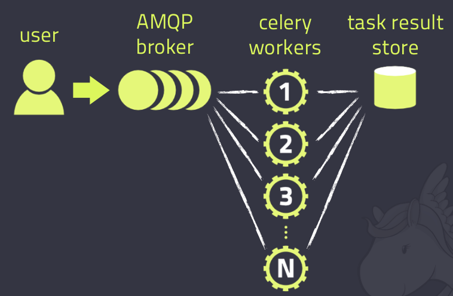
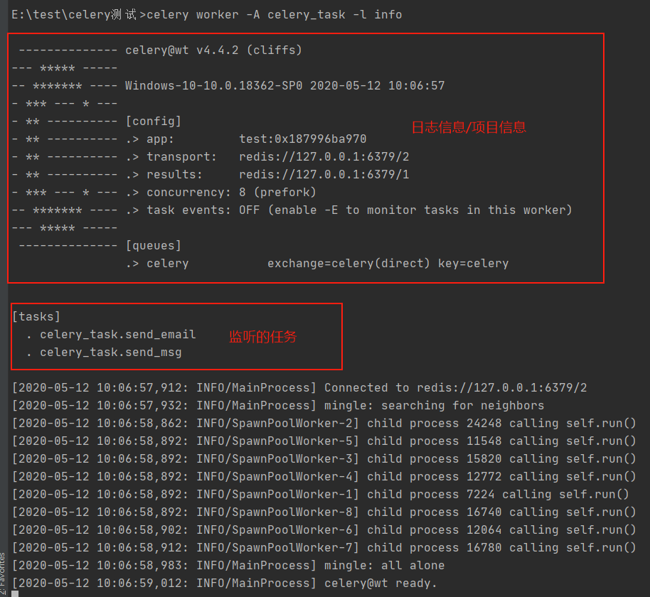
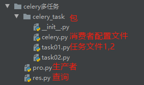

## 什么是Celery

Celery是一个简单、灵活且可靠的，处理大量消息的分布式系统，专注于实时处理的异步任务队列，同时也支持任务调度。



Celery的架构由三部分组成，消息中间件（message broker），任务执行单元（worker）和任务执行结果存储（task result store）组成。

+ Celery本身不提供消息服务，但是可以方便的和第三方提供的消息中间件集成。包括，RabbitMQ, Redis等等
+ Worker是Celery提供的任务执行的单元，worker并发的运行在分布式的系统节点中。
+ Task result store用来存储Worker执行的任务的结果，Celery支持以不同方式存储任务的结果，包括AMQP, redis等

另外， Celery还支持不同的并发和序列化的手段

- 并发：Prefork, Eventlet, gevent, threads/single threaded
- 序列化：pickle, json, yaml, msgpack. zlib, bzip2 compression， Cryptographic message signing 等等

## 使用场景

celery是一个强大的 分布式任务队列的异步处理框架，它可以让任务的执行完全脱离主程序，甚至可以被分配到其他主机上运行。我们通常使用它来实现异步任务（async task）和定时任务（crontab)。

异步任务：将耗时操作任务提交给Celery去异步执行，比如发送短信/邮件、消息推送、音视频处理等等

定时任务：定时执行某件事情，比如每天数据统计

## 优点

+ Simple(简单)：Celery 使用和维护都非常简单，并且不需要配置文件。
+ Highly Available（高可用）：woker和client会在网络连接丢失或者失败时，自动进行重试。并且有的brokers 也支持“双主”或者“主／从”的方式实现高可用。
+ Fast（快速）：单个的Celery进程每分钟可以处理百万级的任务，并且只需要毫秒级的往返延迟（使用 RabbitMQ, librabbitmq, 和优化设置时）
+ Flexible（灵活）：Celery几乎每个部分都可以扩展使用，自定义池实现、序列化、压缩方案、日志记录、调度器、消费者、生产者、broker传输等等。

## 安装

`pip install Celery`

## 使用

### 基本使用

执行异步任务：

消费者：通过celery定义异步任务，创建一个py文件（如：celery_task），通过命令执行

```python
import celery
import time

# 选择两个redis的库，redis会有16个库，选择两个：一个用于消息队列，一个用于数据库（存储结果）
backend = 'redis://127.0.0.1:6379/1'  # 存储异步结果
broker = 'redis://127.0.0.1:6379/2'  # 消息中间件，用rabbitmq就直接换成rabbitmq的地址就可以
cel = celery.Celery('test', backend=backend, broker=broker)  # 生成一个celery对象，第一个参数为项目相关的名字(任意)

# 设置一个装饰器，cel是上面生成的对象
@cel.task
def send_email(name):  # 定义一个异步任务
    print("向%s发送邮件..." % name)
    time.sleep(5)
    print("向%s发送邮件完成" % name)
    return "ok"

# 还可以定义多个其他异步任务
@cel.task
def send_msg(name):  # 定义一个异步任务
    print("向%s发送短信..." % name)
    time.sleep(5)
    print("向%s发送短信完成完成" % name)
    return "ok"

```

通过命令：`celery worker -A celery_task -l info -P eventlet`启动此文件（先pip install eventlet），celery会帮助执行一系列任务（连接，创建队列，启动多个worker监听任务等）。执行结果：



生产者：也需要创建文件（如pro_task）

```python
from .celery_task import send_email, send_msg  # 导入异步任务函数

result = send_email.delay("tim")  # 通过装饰器的delay方法启动
print(result.id)  # 生成任务id
result2 = send_msg.delay("toomeng")
print(result2.id)

```

查询异步执行结果：创建一个文件

```python
from celery.result import AsyncResult
from celery_task import cel  # 导入celery对象

async_result = AsyncResult(id="83984d2e-278a-43d9-ab73-0e4aa4c2c16c", app=cel)  # 通过任务id生成异步结果对象

if async_result.successful():  # 根据情况查询
    result = async_result.get()
    print(result)
    # result.forget() # 将结果删除
elif async_result.failed():
    print('执行失败')
elif async_result.status == 'PENDING':
    print('任务等待中被执行')
elif async_result.status == 'RETRY':
    print('任务异常后正在重试')
elif async_result.status == 'STARTED':
    print('任务已经开始被执行')

```

### 多任务结构



启动时：`celery worker -A 包名 -l info -P eventlet`

celery.py：

```python
from celery import Celery

cel = Celery('celery_demo',
             broker='redis://127.0.0.1:6379/1',
             backend='redis://127.0.0.1:6379/2',
             # 包含以下两个任务文件，去相应的py文件中找任务，对多个任务做分类
             include=['celery_task.task01',
                      'celery_task.task02'
                      ])

# 时区
cel.conf.timezone = 'Asia/Shanghai'
# 是否使用UTC
cel.conf.enable_utc = False

```

task01.py、task02.py：

```python
# task01：
import time
from celery_task.celery import cel
@cel.task
def send_email(res):
    time.sleep(5)
    return "完成向%s发送邮件任务" % res

# task02：
import time
from celery_task.celery import cel
@cel.task
def send_msg(name):
    time.sleep(5)
    return "完成向%s发送短信任务" % name

```

pro：

```python
from celery_task.task01 import send_email
from celery_task.task02 import send_msg

# 立即告知celery去执行test_celery任务，并传入一个参数
result = send_email.delay('tim')
print(result.id)
result = send_msg.delay('tim')
print(result.id)

```

res：

```python
from celery.result import AsyncResult
from celery_task.celery import cel

async_result = AsyncResult(id="562834c6-e4be-46d2-908a-b102adbbf390", app=cel)

if async_result.successful():
    result = async_result.get()
    print(result)
    # result.forget() # 将结果删除,执行完成，结果不会自动删除
    # async.revoke(terminate=True)  # 无论现在是什么时候，都要终止
    # async.revoke(terminate=False) # 如果任务还没有开始执行呢，那么就可以终止。
elif async_result.failed():
    print('执行失败')
elif async_result.status == 'PENDING':
    print('任务等待中被执行')
elif async_result.status == 'RETRY':
    print('任务异常后正在重试')
elif async_result.status == 'STARTED':
    print('任务已经开始被执行')
```

### 定时任务

celery.py：

```python
import celery
import time

backend = 'redis://127.0.0.1:6379/5'
broker = 'redis://127.0.0.1:6379/6'
cel = celery.Celery('test', backend=backend, broker=broker)

@cel.task
def send_email(name):
    print("向%s发送邮件..." % name)
    time.sleep(5)
    print("向%s发送邮件完成" % name)
    return "ok"
```

pro：

```python
from celery_task import send_email, send_msg
from datetime import datetime

# 方式一：设定一个固定时间
v1 = datetime(2020, 5, 12, 11, 15, 00)  # 设置一个定时时间（本地）
print(v1)
v2 = datetime.utcfromtimestamp(v1.timestamp())  # 转换成国际标准时
print(v2)
result = send_email.apply_async(args=["tim", ], eta=v2)  # 使用apply_async方法传入参数和定时的时间（只能标准时间）
print(result.id)  # 获取id

# 方式二：设置一个倒计时
ctime = datetime.now()  # 当前时间
utc_ctime = datetime.utcfromtimestamp(ctime.timestamp())  # 转国标时间
from datetime import timedelta  # 时差类
time_delay = timedelta(seconds=10)  # 通过时差类设置一个十秒的时差
task_time = utc_ctime + time_delay  # 获取定时时间

result = send_email.apply_async(args=["egon"], eta=task_time)  # 使用apply_async并设定时间
print(result.id)

```

### 多任务下定时任务

跟多任务结构的文件结构一样（只有消费者和任务），只是配置文件增加以下内容：

```python
from datetime import timedelta
from celery import Celery
from celery.schedules import crontab

cel = Celery('tasks', broker='redis://127.0.0.1:6379/1', backend='redis://127.0.0.1:6379/2', include=[
    'celery_tasks.task01',
    'celery_tasks.task02',
])
cel.conf.timezone = 'Asia/Shanghai'
cel.conf.enable_utc = False

# 新增内容
cel.conf.beat_schedule = {  # 任务调度器：多个定时任务（键是任务名，值为参数字典(有固定的几个参数)）
    # 名字随意命名，定时任务名字
    'add-every-10-seconds': {
        # 执行tasks1下的test_celery函数，填上路径
        'task': 'celery_task.task01.send_email',
        # 每隔多少秒执行一次
        # 'schedule': 1.0,
        # 'schedule': crontab(minute="*/1"),  # 
        'schedule': timedelta(seconds=6),
        # 传递参数（元祖）
        'args': ('张三',)
    },
    # 'add-every-12-seconds': {
    #     'task': 'celery_task.task01.send_email',
    #     每年4月11号，8点42分执行
    #     'schedule': crontab(minute=42, hour=8, day_of_month=11, month_of_year=4),
    #     'args': ('张三',)
    # },
} 

```

多任务下的定时任务没有生产者，通过命令`celery beat -A 包名` 之后celery会读取配置文件中的内容，周期性的执行文件。注意：最好先启动消费者监听，再执行beat，否则会产生很多的历史遗留任务（历史遗留任务清理：在redis中就是一个name为celery的链表，删除即可），关闭worker之前先关闭beat

### 在Django项目中使用celery

1. 创建Django项目

2. 在项目根目录中创建celery包，目录结构如下：

   ```
   mycelery/  # 包
   ├── config.py  # 配置文件
   ├── __init__.py
   ├── main.py
   └── sms/  # 定义的一个任务，一个包
       ├── __init__.py
       ├── tasks.py  # 每个任务必须有一个tasks文件，celery的任务必须写在tasks文件中，别的文件名字不识别
   └── email/  # 定义的另一个任务，还可以加其他任务
       ├── __init__.py
       ├── tasks.py
   ```

   配置文件：定义消息中间件和异步缓存结果数据库

   ```python
   broker_url = 'redis://127.0.0.1:6379/15'  # 消息队列
   result_backend = 'redis://127.0.0.1:6379/14'
   ```

   tasks文件（例）：

   ```python
   from mycelery.main import app
   import time
   import logging
   
   log = logging.getLogger("django")
   
   @app.task  # name表示设置任务的名称，如果不填写，则默认使用函数名做为任务名
   def send_sms(mobile):
       """发送短信"""
       print("向手机号%s发送短信成功!"%mobile)
       time.sleep(5)
       return "send_sms OK"
   
   @app.task  # name表示设置任务的名称，如果不填写，则默认使用函数名做为任务名
   def send_sms2(mobile):
       print("向手机号%s发送短信成功!" % mobile)
       time.sleep(5)
       return "send_sms2 OK"
   ```

   main文件：对Django的配置文件进行加载

   ```python
   import os
   from celery import Celery
   
   app = Celery("sms")  # 创建celery实例对象，也可以在这里进行配置broker等，但耦合性就高了
   
   os.environ.setdefault('DJANGO_SETTINGS_MODULE', 'celeryPros.settings.dev')  # 把celery和django进行组合，识别和加载django的配置文件
   
   app.config_from_object("mycelerys.config")  # 通过app对象加载配置
   
   # 加载任务
   # 参数必须必须是一个列表，里面的每一个任务都是任务的路径名称，只加到包就行，自动找task文件
   # app.autodiscover_tasks(["任务1","任务2"])
   app.autodiscover_tasks(["mycelerys.sms",])
   
   # 启动Celery的命令
   # 强烈建议切换目录到mycelery根目录下启动
   # celery -A mycelery.main worker --loglevel=info
   ```

   通过命令启动worker

3. 在视图中设置生产者任务

   ```python
   from django.shortcuts import render, HttpResponse
   from mycelery.sms.tasks import send_sms, send_sms2
   from datetime import timedelta, datetime
   
   def test(request):
       # 异步任务
       # send_sms.delay("110")
       # send_sms2.delay("119")
   
       # 定时任务
       ctime = datetime.now()
       utc_ctime = datetime.utcfromtimestamp(ctime.timestamp())
       time_delay = timedelta(seconds=10)
       task_time = utc_ctime + time_delay
       result = send_sms.apply_async(["911", ], eta=task_time)
       result = send_sms2.apply_async(["120", ], eta=task_time)
       print(result.id)
       
       return HttpResponse('OK')
   
   ```

   

