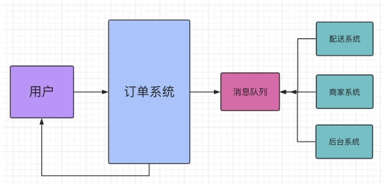
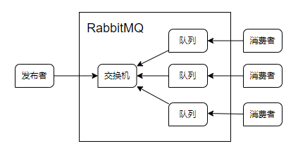
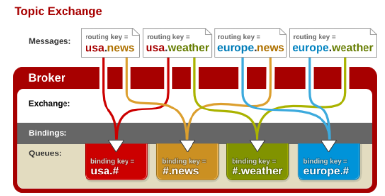

## 消息队列
MQ全称为Message Queue 消息队列（MQ）是一种应用程序对应用程序的通信方法。MQ是消费-生产者模型的一个典型的代表，一端往消息队列中不断写入消息，而另一端则可以读取队列中的消息。这样发布者和使用者都不用知道对方的存在。

生产者消费者模式是通过一个容器来解决生产者和消费者的强耦合问题。生产者和消费者彼此之间不直接通讯，而通过阻塞队列来进行通讯，所以生产者生产完数据之后不用等待消费者处理，直接扔给阻塞队列，消费者不找生产者要数据，而是直接从阻塞队列里取，阻塞队列就相当于一个缓冲区，平衡了生产者和消费者的处理能力。

消息队列可以简单理解为：把要传输的数据放在队列中。

### 队列

队列是一种先进先出的数据结构
```python
import queue  # python中的线程队列。进程队列是在另一个库中

q = queue.Queue(maxsize=10)  # 创建一个队列

q.put(111)
q.put(222)
q.put(333)

print(q.get())  # 按顺序取出
print(q.get())
print(q.get())
print(q.get())  # 默认没有数据时阻塞，设置参数block=False就是报错：q.get(block=False)
```

## 为什么要用消息队列
消息队列中间件是分布式系统中重要的组件，主要解决应用解耦，异步消息，流量削锋等问题，实现高性能，高可用，可伸缩和最终一致性架构。目前使用较多的消息队列有ActiveMQ，RabbitMQ，ZeroMQ，Kafka，MetaMQ，RocketMQ。



## RabbitMQ
RabbitMQ 是一个由 Erlang 语言开发的 AMQP 的开源实现。

rabbitMQ是一款基于AMQP协议的消息中间件，它能够在应用之间提供可靠的消息传输。在易用性，扩展性，高可用性上表现优秀。使用消息中间件利于应用之间的解耦，生产者（客户端）无需知道消费者（服务端）的存在。而且两端可以使用不同的语言编写，大大提供了灵活性。

### 安装
#### Windows

1. 下载安装rabbitmq：https://www.rabbitmq.com/download.html。全默认
2. 下载安装Erlang：http://www.erlang.org/download/otp_win64_17.3.exe。全默认

使用：

1. 安装完成后，开始菜单出现`RabbitMQ Command Prompt (sbin dir)`，打开，输入命令：`rabbitmq-plugins enable rabbitmq_management` 启动管理工具。
2. 使用`net stop/start RabbitMQ`命令启动和停止rabbitMQ，也可以通过开始菜单的stop和start快捷方式启动和关闭
3. 浏览器：http://127.0.0.1:15672/ 
4. 使用默认账号登陆：guest/guest

#### Linux

1. 安装Erlang
    ```
    安装依赖：yum -y install make gcc gcc-c++  kernel-devel m4 ncurses-devel openssl openssl-devel xmlto zip unzip
    下载安装包：wget http://www.erlang.org/download/otp_src_17.3.tar.
    解压：tar -zxvf otp_src_17.3.tar.gz
    进入文件夹：cd otp_src_17.3
    配置：./configure
    安装：make && make install
    ```
2. 安装RabbitMQ
    ```
    下载：wget http://www.rabbitmq.com/releases/rabbitmq-server/v3.4.1/rabbitmq-server-3.4.1.tar.gz

    解压：tar -zxvf rabbitmq-server-3.4.1.tar.gz

    cd rabbitmq-server-3.4.1

    安装：make TARGET_DIR=/usr/local/rabbitmq/ SBIN_DIR=/usr/local/rabbitmq/sbin MAN_DIR=/usr/local/rabbitmq/man DOC_INSTALL_DIR=/usr/local/rabbitmq/doc install
    ```
3. 启动关闭rabbitmq
    ```
    cd /usr/local/rabbitmq/sbin

    启动: 
    ./rabbitmq-server start  #控制台开启
    ./rabbitmq-server  -detached #后台启动

    关闭服务:
    ./rabbitmqctl stop #关闭

    重启服务:
    ./rabbitmq-server restart   # 重启

    查看状态:
    ./rabbitmq-server status

    ```
远程访问：
```
开放15672,55672端口

guest这个默认的用户只能通过http://localhost:15672 来登录，不能使用IP地址登录，也就是不能远程访问，这对于服务器上没有安装桌面的情况是无法管理维护的。要解决这个问题增加用户。

/usr/local/rabbitmq/sbin/rabbitmqctl add_user admin admin

/usr/local/rabbitmq/sbin/rabbitmqctl list_users

/usr/local/rabbitmq/sbin/rabbitmqctl set_user_tags admin administrator

访问  ip:15672 输入用户就能登录了:
```

### 工作模型

简单模式、交换机模式（包括：发布订阅、关键字模式、模糊匹配模式）

#### 简单模式

队列中的数据只能被一个消费者取走，若多个消费者要同一个数据，需要用发布订阅模式

生产者：

1. 链接rabbitmq

2. 创建队列

3. 向指定的队列插入数据

   ```python
   import pika  # python操控rabbitmq的模块，需要pip install
   
   connection = pika.BlockingConnection(pika.ConnectionParameters('localhost'))  # 连接rabbitmq返回连接对象
   channel = connection.channel()  # 通过连接对象生成控制对象
   
   channel.queue_declare(queue='hello')  # 创建一个队列
   
   channel.basic_publish(exchange='',  # 交换机参数为空
                         routing_key='hello',  # 指定队列
                         body='Hello World!')  # 数据
   
   print(" [x] Sent 'Hello World!'")
   
   ```

消费者：

1. 连接rabbitmq

2. 监听模式

3. 确定回调函数

   ```python
   import pika
   
   connection = pika.BlockingConnection(pika.ConnectionParameters('localhost'))  # 连接
   channel = connection.channel()
   
   channel.queue_declare(queue='hello')  # 同样创建一个队列（不能保证生产者先运行）
   
   def callback(ch, method, properties, body):  # 确定回调函数
       print(" [x] Received %r" % body)
   	# ch.basic_ack(delivery_tag=method.delivery_tag)  # 应答为False时使用
       
   # channel.basic_qos(prefetch_count=1)  # 公平分发，不设置就默认轮询分发
   # 确定监听队列参数
   channel.basic_consume(queue='hello',  # 指定队列
                         auto_ack=True,  # 默认应答
                         on_message_callback=callback)  # 指定回调函数，有了消息就指定回调函数
   
   
   print(' [*] Waiting for messages. To exit press CTRL+C')
channel.start_consuming()  # 启动监听
   ```
   
   

##### 参数

应答参数：

```python
auto_ack=False  # 应答参数，默认为True，消费者取走之后就直接没有了，如果回调函数出错则数据就直接丢失，参数改为False表示手动应答，消费者取走之后还存在，需要在回调函数最后添加指示（下句），给消息队列消息删除消息。根据数据的使用情况设置，True时效率高，false时效率低但安全
ch.basic_ack(delivery_tag=method.delivery_tag)  # 在回调函数最后，固定
```

持久化参数：防止rabbitmq服务崩溃

```python
#声明queue
channel.queue_declare(queue='hello2', durable=True)  # 若声明过，则换一个名字(不然会报错)，并声明队列为持久化队列
 
channel.basic_publish(exchange='',
                      routing_key='hello2',
                      body='Hello World!',
                      properties=pika.BasicProperties(
                          delivery_mode=2,  # 2让信息持久化，
                          )
                      )
```

分发参数：有两个消费者同时监听一个的队列。其中一个线程sleep2秒，另一个消费者线程sleep1秒，但是处理的消息是一样多。这种方式叫轮询分发（round-robin）不管谁忙，都不会多给消息，总是你一个我一个。想要做到公平分发（fair dispatch），必须关闭自动应答ack，改成手动应答。使用basicQos(perfetch=1)限制每次只发送不超过1条消息到同一个消费者，消费者必须手动反馈告知队列，才会发送下一个。

```python
channel.basic_qos(prefetch_count=1)  # 在监听队列参数之前
```


#### 交换机模式

##### 发布订阅

发布订阅和简单的消息队列区别在于，发布订阅会将消息发送给所有的订阅者，而消息队列中的数据被消费一次便消失。所以，RabbitMQ实现发布和订阅时，会为每一个订阅者创建一个队列，而发布者发布消息时，会将消息放置在所有相关队列中。



生产者：

1. 连接rabbitmq

2. 创建交换机（不创建队列）

3. 向交换机插数据（交换机会分发给每个队列）

   ```python
   import pika  # python操控rabbitmq的模块，需要pip install
   
   connection = pika.BlockingConnection(pika.ConnectionParameters('localhost'))  # 连接rabbitmq返回连接对象
   channel = connection.channel()  # 通过连接对象生成控制对象
   
   channel.exchange_declare(exchange='logs', exchange_type='fanout')  # 声明名为logs的交换机，fanout表示发布订阅模式
   
   message = " info ： hello world "
   channel.basic_publish(exchange='logs',  # 指定交换机
                         routing_key='',  # 队列为空
                         body=message)  # 数据
   
   print(" [x] Sent 'Hello World!'")
   connection.close()  # 关闭连接
   ```

   

消费者：

1. 连接rabbitmq

2. 创建队列（每个消费者创建一个属于自己的队列）

3. 绑定到交换机

4. 监听并确定回调函数

   ```python
   import pika
   
   connection = pika.BlockingConnection(pika.ConnectionParameters('localhost'))  # 连接
   channel = connection.channel()
   
   channel.exchange_declare(exchange='logs', exchange_type='fanout')  # 声明一个交换机，要确保有交换机（如果消费者先启动）
   
   result = channel.queue_declare('', exclusive=True)  # 创建队列，exclusive为True表示创建一个随机名字队列
   queue_name = result.method.queue  # 拿到队列名字
   
   channel.queue_bind(exchange='logs', queue=queue_name)  # 将队列绑定到指定交换机
   
   def callback(ch, method, properties, body):  # 确定回调函数
       print(" [x] Received %r" % body)
   
   # 确定监听队列参数
   channel.basic_consume(queue=queue_name,  # 指定队列
                         auto_ack=True,  # 默认应答
                         on_message_callback=callback)  # 指定回调函数，有了消息就指定回调函数
   
   print(' %s [*] Waiting for messages. To exit press CTRL+C' % queue_name)
   channel.start_consuming()  # 启动监听
   
   ```

   

##### 关键字模式

队列在和交换机绑定时会同时设置一个关键字，发布着在发布时也会设置关键字，关键字匹配上才会给相应的队列发送消息

发布者：

```python
import pika
# 连接
connection = pika.BlockingConnection(pika.ConnectionParameters(host='localhost'))
channel = connection.channel()

channel.exchange_declare(exchange='logs2', exchange_type='direct')  # 模式换成direct

message = "info: Hello Yuan!"
channel.basic_publish(exchange='logs2',
                      routing_key='info',  # 设置上关键字
                      body=message)
print(" [x] Sent %r" % message)
connection.close()
```

消费者：

```python

import pika

connection = pika.BlockingConnection(pika.ConnectionParameters(host='localhost'))
channel = connection.channel()

channel.exchange_declare(exchange='logs2', exchange_type='direct')  # 交换机类型

result = channel.queue_declare("",exclusive=True)  # 队列
queue_name = result.method.queue

# 将队列绑定到交换机，并设置上关键字,可设置多个,写多个queue_bind
channel.queue_bind(exchange='logs2',
                   queue=queue_name,
                   routing_key='info')  # 设置关键字
channel.queue_bind(exchange='logs2',
                   queue=queue_name,
                   routing_key='error')

print(' [*] Waiting for logs. To exit press CTRL+C')

def callback(ch, method, properties, body):  # 回调函数
    print(" [x] %r" % body)

channel.basic_consume(queue=queue_name,  # 指定监听参数
                      auto_ack=True,
                      on_message_callback=callback)

channel.start_consuming()
```


##### 通配符模式

在关键字模式上添加了通配符，有两种：# 匹配一个或多个词，* 仅匹配一个词



生产者：

```python
message = "info: Hello Yuan!"
channel.basic_publish(exchange='logs2',
                      routing_key='usa.news',  # 设置上统配关键字
                      body=message)
print(" [x] Sent %r" % message)
connection.close()
```

消费者：

```python
channel.queue_bind(exchange='logs2',
                   queue=queue_name,
                   routing_key='usa.#')  # 设置统配关键字
channel.queue_bind(exchange='logs2',
                   queue=queue_name,
                   routing_key='#.news')
channel.queue_bind(exchange='logs2',
                   queue=queue_name,
                   routing_key='*.weather')
```

