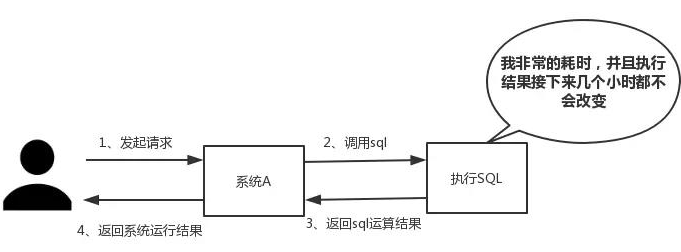

# Redis 简介

Redis 是一个高性能的key-value数据格式的内存缓存，NoSQL数据库。NOSQL：not only sql，泛指非关系型数据库。关系型数据库: (mysql, oracle, sql server, sqlite)
```
1. 数据存放在表中，表之间有关系。
2. 通用的SQL操作语言。
3. 大部分支持事务。
```
非关系型数据库[ redis，hadoop，mangoDB]:
```
1. 没有数据表的概念，不同的nosql数据库存放数据位置不同。
2. nosql数据库没有通用的操作语言。
3. 基本不支持事务。   redis支持简单事务
```
redis是业界主流的key-value nosql 数据库之一。和Memcached类似，它支持存储的value类型相对更多，包括string(字符串)、list(链表)、set(集合)、zset(sorted set --有序集合)和hash（哈希类型）。这些数据类型都支持push/pop、add/remove及取交集并集和差集及更丰富的操作，而且这些操作都是原子性的。在此基础上，redis支持各种不同方式的排序。与memcached一样，为了保证效率，数据都是缓存在内存中。区别的是redis会周期性的把更新的数据写入磁盘或者把修改操作写入追加的记录文件，并且在此基础上实现了master-slave(主从)同步。redis是一款基于CS架构的数据库，所以redis有客户端，也有服务端。其中，客户端可以使用python等编程语言，也可以终端命令行工具

## 优点
+ 异常快速 : Redis是非常快的，每秒可以执行大约110000设置操作，81000个/每秒的读取操作。
+ 支持丰富的数据类型 : Redis支持最大多数开发人员已经知道如列表，集合，可排序集合，哈希等数据类型。
+ 原子 – Redis的所有操作都是原子性的，意思就是要么成功执行要么失败完全不执行。单个操作是原子性的。多个操作也支持事务，即原子性，通过MULTI和EXEC指令包起来。
+ Redis是一个多功能实用工具，可以在很多如，消息传递队列中使用（Redis原生支持发布/订阅）
+ 单线程特性，秒杀系统，基于redis是单线程特征，防止出现数据库“爆破”

## 应用
+ 性能：Redis 中缓存热点数据，能够保护数据库，提高查询效率。如下图所示，我们在碰到需要执行耗时特别久，且结果不频繁变动的SQL，就特别适合将运行结果放入缓存。这样，后面的请求就去缓存中读取，使得请求能够迅速响应。
    
+ 并发：还是如上图所示，在大并发的情况下，所有的请求直接访问数据库，数据库会出现连接异常。这个时候，就需要使用redis做一个缓冲操作，让请求先访问到redis，而不是直接访问数据库。

## 安装

centos：
1. 安装第三方源：yum install epel-release
2. 安装redis：yum install redis
3. 启动：service redis start 或  redis-server
4. 修改配置文件：vim /etc/redis.conf
    + 注释掉ip绑定(这个只允许本地调试,不注释掉这个,你远程这个redis的时候会提示:redis.clients.jedis.exceptions.JedisConnectionException: java.net.ConnectException: Connection refused: connect)：# bind 127.0.0.1
    + 关闭保护模式(不关闭的话远程这个redis会提示:redis.clients.jedis.exceptionsJedisDataException: DENIED Redis is running in protected mode)：protected-mode no
5. 查看redis是否运行：redis-cli。会打开提示符，输入ping，如果返回pong就安装成功

Windows：https://github.com/MicrosoftArchive/redis/tags

# python操作redis
redis-py提供两个类Redis和StrictRedis用于实现Redis的命令，StrictRedis用于实现大部分官方的命令，并使用官方的语法和命令，Redis是StrictRedis的子类，用于向后兼容旧版本的redis-py。
## 连接redis
1. pip install redis ：安装模块
2. import redis：导入模块
3. 连接：
    + 基本连接方式：r = redis.Redis(host='redis地址', port=6379) ：连接redis，并生成一个操作对象，对redis的所有操作都通过这个对象
    + 基于连接池连接：通过连接池保持连接，效率高，不用每次操作都要断开再连接
        ```
        pool = redis.ConnectionPool(host='10.211.55.4', port=6379)  # 创建一个连接池
        r = redis.Redis(connection_pool=pool)  # 通过连接池生成一个操作对象
        ```

## 操作

redis键值对的值的类型：
1. string类型：基础的数据类型，是二进制的（byte类型）。最大容量512M
2. hash类型：键值对，类似于python字典，值只能是string：`name:{键:值,键:值....}`
3. list类型：类似于python列表：每个元素类型为string
4. set类型：无序集合，元素为string，唯一不重复，没有修改操作
5. zset类型：有序集合，元素为string，唯一不重复，没有修改操作

### String操作
键值对都必须是string类型
```
r.set("name","value",ex=None,px=None,nx=False,xx=False)  ：设置键值对
    # 可选参数：
    ex=过期时间(秒)(默认)；
    px=过期时间(毫秒)；
    nx=True/False：如果为true表示只有name不存在时才进行set操作(防止覆盖)；
    xx=True/False:与nx相反
r.setnx(name,value)：设置值，只有name不存在时，执行操作
r.setex(name,value,time)：time表示过期时间(秒)
r.psetex(name,time_ms,value)：过期时间(毫秒)

r.mset(*args, **kwargs)：批量设置值
    如：r.mset(k1="v1",k2="v2")
    或：r.mset({'k1':'v1', 'k2':'v2'})

r.get("name")：取值
r.mget(["name1","name2"])：批量取值

r.getset(name,value)：给name设置新值，并返回原来的值

r.getrange(name,start,end)：获取name的值子序列（根据字节获取，非字符）。相当于切片
r.setrange(name,offset,value)：修改值的内容，从指定索引(offset)开始向后替换，超出则添加在后面，value表示替换的值

r.strlen(name):返回对应值的长度

r.incr(name,数字)：name对应的值自增，默认为1
r.incrbyfloat(name,浮点数)：自增可以是浮点数
r.decr(name,数字)：自减

r.append(name,value):给name对应的值追加内容
```

### hash操作
值为类似于python的dict的类型
```
r.hset(name,key,value):创建一条数据，name为redis的name，key为hash的key，value为hash的value
r.hget(name,key):获取name下的一个key的值

r.hmset(name,{k1:1,k2:v2}):批量设置
r.hgetall(name):获取name下的全部值
r.hmget(name,[k1,k2...]):取多个值

r.hlen(name):获取对应name的长度(元素个数)

r.hkeys(name)：获取name下所有的key
r.hvals(name):获取name下所有的value

r.hexists(name,key):判断name下某个key存不存在

r.hdel(name,key):删除name下一个键值对

r.hincrby(name, key, amount=1):对应的如果是数字就自增
r.hincrbyfloat(name, key, 浮点数)：自增步数为浮点数

r.hscan_iter(name,match=None,count=None):利用yield封装hscan创建生成器，实现分批去redis中获取数据
    # 参数：
    # match，匹配指定key，默认None 表示所有的key
    # count，每次分片最少获取个数，默认None表示采用Redis的默认分片个数
    # 如：
        # for item in r.hscan_iter('xx'):
        #     print item
```

### list操作
每个name对应一个链表(类似python列表)
```
r.lpush(name,v1,v2....):创建一条数据,按输入相反顺序存储
r.rpush(name,v1,v2....):创建一条数据,按输入顺序存储

r.lrange(name,star,end):列表取值，star和end表示索引，类似切片

r.lpushx(name,value)：给name添加元素，添加到list的左边，只有name存才才会加，不存在无效
r.rpushx(name,value): 给name添加元素，添加到list的右边

r.llen(name):返回name对用的list长度

r.linsert(name,where,refvalue,value):插入值
    # name，redis的name
    # where，BEFORE或AFTER
    # refvalue，标杆值，即：在它前后插入数据
    # value，要插入的数据

r.lset(name,index,value):修改索引对应的值

r.lrem(name,value,count):删除指定值后面指定数量的值
    # count=0 表示删除全部
    # count = 数字 表示删除多少个元素，从左向右删除
    # count = 负数 表示从右向左删除

r.lpop(name):从左向右删除一个，并返回值
r.rpop(name):从右向左删除

r.lindex(name,index):根据索引返回元素值

r.ltrim(name,start,end):移除在索引star-end之外的元素

```

### set操作
不允许重复的list

```
r.sadd(name,*values):创建集合数据

r.smembers(name):查看name的数据

r.scard(name):查看set中的元素个数

r.sinter(name1,name2,...):交集
r.sunion(name1,name2...):并集
r.sdiff(name1,name2...):差集，只在第一个集合中有的元素

r.sismember(name,value):判断value是否在name中

r.spop(name):随机删除一个元素并返回

r.srandmember(name,count):从name中随机取count个数据

r.srem(name,v1,v2...):删除某些值

r.sscan_iter(name, match=None, count=None)：同hash的scan_iter相同操作，用于增量迭代分批获取元素，避免内存消耗太大
```

### sort set操作
有序集合，在集合的基础上，为每个元素排序，元素的排序需要根据另外一个值来进行比较，所以，对于有序集合，每一个元素有两个值，即：值和分数，分数专门用来做排序。
```
r.zadd(name,{v1:1,v2:2,v3:3,}):创建有序集合，传入类似hash的数据，前面为值，对应的为分数（原生语法为分数在前，值在后）
r.zscan(name):查看内容(原生语法中没有)，返回一个元祖，第一个表示游标，第二个元素是内容

r.zcard(name):统计元素个数

r.zcount(name,min,max):获取name中元素分数在min-max之间的元素个数

r.zincrby(name,value,amount):对value的分数自增，

r.zrange(name,start,end,desc=False,withscores=True,score_cast_func=int):按照索引范围获取name对应的有序集合的元素
    # name    redis的name
    start   有序集合索引起始位置索引
    end     有序集合索引结束位置索引
    desc    排序规则，默认按照分数从小到大排序
    withscores  是否获取元素的分数，默认只获取元素的值
    score_cast_func 对分数进行数据转换的函数

r.zscore(name,value):获取value的分数

r.zrank(name,value):获取value在集合中的排行，从小到大，从0开始
r.zrevrank(name,value):从大到小取排行

r.zrem(name,values):删除name的value,多个元素用列表
r.zremrangebyrank(name, min, max)：根据排行范围删除
r.zremrangebyscore(name, min, max)：根据分数范围删除

r.zinterstore(newname, (name1,name2), aggregate=None):获取两个有序集合的交集,并生成newname，如果遇到相同值不同分数，则按照aggregate进行操作,aggregate的值为:  SUM(默认,相加分数)  MIN  MAX
r.zunionstore(newname, (name1,name2), aggregate=None):获取两个有序集合的并集,并生成newname，如果遇到相同值不同分数，则按照aggregate进行操作,aggregate的值为:  SUM(默认,相加分数)  MIN  MAX

```

### 其他常用操作
```
r.keys():查看redis中所有的name
    # KEYS * 匹配数据库中所有 key 。
    # KEYS h?llo 匹配 hello ， hallo 和 hxllo 等。
    # KEYS h*llo 匹配 hllo 和 heeeeello 等。
    # KEYS h[ae]llo 匹配 hello 和 hallo ，但不匹配 hillo

r.delete(*names):删除某个name

r.exists(name):判断某个name是否存在

r.expire(name,time):给某个name设置过期时间，单位为秒

r.rename(name,newname):为某个name重命名

r.randomkey():获取一个随机的name，不删除

r.type(name)：获取某个name的类型

r.scan(cursor=0):查看所有键（cursor默认为0，查看所有）
r.scan_iter(match=None, count=None):查看键的生成器，用法同前面的生成器

redis切换库：`select 库名`。总共有16个库，从数字1到16
用python连接redis的某个库时：redis.Redis(host=xxx,port=6379,db=1) 需要填db参数
```

### 使用场景
```
(一)String

这个其实没啥好说的，最常规的set/get操作，value可以是String也可以是数字。一般做一些复杂的计数功能的缓存，比如减少库存。


(二)hash


这里value存放的是结构化的对象，比较方便的就是操作其中的某个字段。博主在做单点登录的时候，就是用这种数据结构存储用户信息，以cookieId作为key，设置30分钟为缓存过期时间，能很好的模拟出类似session的效果。


(三)list


使用List的数据结构，可以做简单的消息队列的功能。另外还有一个就是，可以利用lrange命令，做基于redis的分页功能，性能极佳，用户体验好。本人还用一个场景，很合适---取行情信息。就也是个生产者和消费者的场景。LIST可以很好的完成排队，先进先出的原则。


(四)set


因为set堆放的是一堆不重复值的集合。所以可以做全局去重的功能。

另外，就是利用交集、并集、差集等操作，可以计算共同喜好，全部的喜好，自己独有的喜好等功能。


(五)sorted set


sorted set多了一个权重参数score,集合中的元素能够按score进行排列。可以做排行榜应用，取TOP N操作。
```


## 管道

redis-py默认在执行每次请求都会创建（连接池申请连接）和断开（归还连接池）一次连接操作，如果想要在一次请求中指定多个命令，则可以使用pipline实现一次请求指定多个命令，并且默认情况下一次pipline 是原子性操作。类似于mysql中的事务，要么一起成功要么一起失败

```python
import redis
  
pool = redis.ConnectionPool(host='10.211.55.4', port=6379)
r = redis.Redis(connection_pool=pool)
# pipe = r.pipeline(transaction=False)
pipe = r.pipeline(transaction=True)  # 设置一个管道（事务）
  
pipe.set('name', 'alex')  # 通过管道执行操作
xxx # 报错之后前面的也不会执行
pipe.set('role', 'sb')
  
pipe.execute()  # 执行管道
```

## 发布订阅

多个订阅者可以监听redis中的一个name，发布者通过给name设置set值，每个订阅者会收到消息

发布订阅的特性用来做一个简单的实时聊天系统再适合不过了，当然这样的东西开发中很少涉及到。再比如在分布式架构中，常常会遇到读写分离的场景，在写入的过程中，就可以使用redis发布订阅，使得写入值及时发布到各个读的程序中，就保证数据的完整一致性。再比如，在一个博客网站中，有100个粉丝订阅了你，当你发布新文章，就可以推送消息给粉丝们拉。

实现：
```python
# 订阅者：
import redis

r = redis.Redis(host='127.0.0.1')

pub = r.pubsub()  # 生成发布订阅对象

pub.subscribe('name')  # 监听redis的某个name
pub.parse_response()  # 开启监听

while 1:  # 持续监听
    msg = pub.parse_response()
    print(msg)

# 发布者：
import redis
r = redis.Redis(host='127.0.0.1')
r.publish('name','content')  # 通过name键发布消息
```