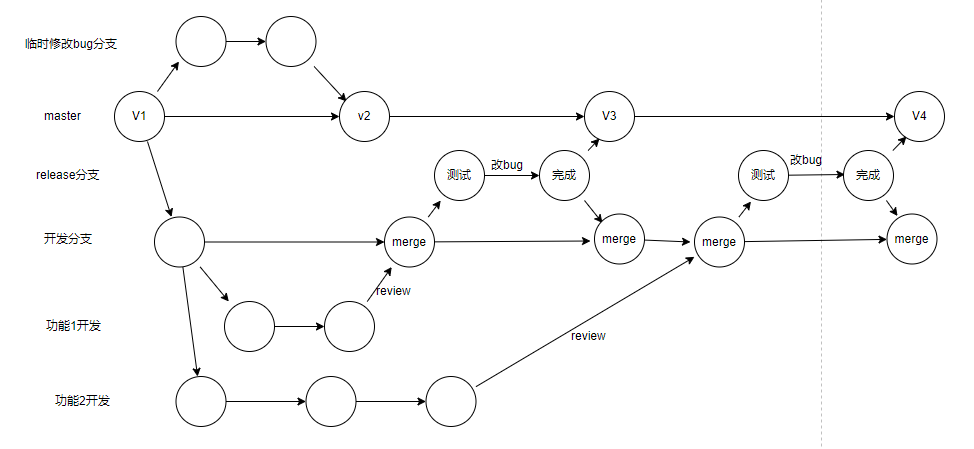

# git是什么
Git是分布式版本控制软件

仓库存放所有的版本，本地也存放所有的版本，提高系统的健壮性。集中式版本控制软件是一个服务端仓库存放所有版本，本地只存放一个版本

---

# Git安装

Windows：
1. 下载安装包，默认安装
2. git --version：查看git版本

linux：
yum install git

# Git配置
如果没有配置，commit时会报错

配置命令：配置用户名和邮箱
```git
git config --global user.email "邮箱"
git config --global user.name "名字"
```

---

# Git知识
## Git三大区域
+ 工作区：
    两种文件状态：已管理文件（生成了版本）和新增/修改文件（红色）
+ 暂存区：
    通过`git add`添加的文件都在暂存区（绿色），可回滚、可提交版本
+ 版本库：
    通过`git commit`提交的版本

---

# Git使用
## 基础
版本控制（Git管理文件夹）步骤：
1. 进入要管理的文件夹
2. 初始化：`git init`
3. 管理：
    + `git status`：检测文件状态
    + `git add 文件/.` ：管理文件或全部文件，管理起来的文件会变绿
    
    三种状态的变化：
    + 红色：新增的文件/修改了原老文件
    + 绿色：通过`git add`命令之后被git管理起来的文件
    + 查询不到：通过`git commit`生成了版本
4. 生成版本：`git commit -m "描述信息"`：生成一个版本
5. 查看版本：`git log`。
    + `git log --graph`：以流程线图显示版本记录
    + `git log --graph --pretty=format:"%h %s"`：简洁显示，只显示哈希值和记录字符串

## 回滚
回滚到以前的版本到工作区(本地-管理状态)：`git reset --hard 版本号`。版本号为每次commit时生成的，通过`git log`命令查看

向前滚动版本(将版本库的某个版本替换成工作区)：`git reset --hard 版本号`。版本号通过`git reflog`命令查看

将版本库某个版本回滚到暂存区：`git reset --soft 版本号`

从暂存区回滚到工作区（绿色→未管理红色）：`git reset HEAD`

从版本库回滚到工作区(未管理状态红色)：`git reset --mix 版本号`

将改动的文件改回被管理时状态（未管理状态红色→干净状态）：`git checkout -- 文件`


## 分支

开发新功能时可以另开新分支开发

+ 查看所处分支：`git branch`
+ 创建分支：`git branch 分支名`
+ 切换分支：`git checkout 分支名`
+ 合并分支：先切换会主分支，使用命令`git merge 分支名`合并分支
+ 删除分支：`git branch -d 分支名`

紧急修复线上bug的思路：另开一个新分支去修复主线上的bug，不影响别的分支上的开发功能，完成修复之后合并到主分支(master)。合并新功能时会有冲突，新功能分支上的bug没有被修复，需要去手动修改文件，之后再add和commit


### 工作流
初始项目开始后第一个版本后应该创建一个dev分支，在dev分支上做开发。master分支上是稳定版本，等dev上的开发完成或测试稳定后再合并到master。（注意：合并到主分支后再返回dev分支开发时要合并主分支(如果主分支是最新的)，`git merge master`合并之后使dev分支也是在新功能基础上继续开发

---


# GitHub

代码托管仓库

绑定远程仓库前，现在本地生成ssh的key进行远程仓库验证(绑定当前电脑)

```shell
ssh-keygen -t rsa  # 一路回车后再/root/.ssh/下生成文件密钥
将生成的公钥id_rsa.pub  绑定github
```

## 使用
创建仓库（不勾选readme，创建一个空仓库），如果本地没有仓库，按以下操作：
```shell
echo "# tools" >> README.md  # 创建一个readme.md文件，
git init  # 初始化
git add README.md  # 使用git管理
git commit -m "first commit"  # 提交本地版本库
git remote add origin git@github.com:tinistyle/tools.git  # 绑定远程仓库，origin表示远程仓库的别名
git push -u origin master  # 推送
```

本地已经有仓库时：
```shell
git remote add origin git@github.com:tinistyle/tools.git  # 绑定远程仓库
git push -u origin master  # 推送
```

## 推送
`git push -u origin 分支`

## 拉取
从远程仓库拉取代码到本地

`git clone 远程仓库地址`：拉取下来的分支都有，但是不会显示，可以直接切换分支


## 远程仓库命令小结
+ 给远程仓库起别名：`git remote add 别名 远程仓库地址`
+ 给远程仓库推送代码（从本地版本库推送到远程仓库）：`git push -u 远程仓库别名 分支`。可以不要-u
+ 克隆远程仓库代码：`git clone 远程仓库地址` （内部已实现`git remote add origin 地址`）。注意：克隆下来的代码默认所在的分支是在master
+ 更新本地仓库代码：`git pull 别名 分支`（拉取远程仓库的代码更新本地工作区）常用
+ 更新本地版本库代码：`git fetch 别名 分支`（拉取远程仓库的代码更新本地版本库）不常用
+ 从本地版本库合并到本地工作区：`git merge 别名/分支` 或 `git rebase 别名/分支` （必须有/，表示是远程仓库的）

多地开发流程：（例：公司-家）
1. 公司开发，注意分支合并master保持开发分支最新处开始，完成后推送分支到远程仓库
2. 回家后，克隆远程仓库到本地，默认在master，注意切换分支后开发。完成后提交到远程仓库
3. 到公司，更新本地仓库分支，继续开发，再推送到远程仓库
4. 回家后，更新本地仓库分支。继续开发，再推送到远程仓库
5. 循环往复
6. 开发完毕：合并分支到master，推送master分支和开发分支到远程仓库（可以在开发分支也把master合并了）

## rebase
变基，使git记录简洁

使用场景：
1. 合并多个提交记录：注意，尽量不要合并已提交到远程仓库的记录
    + `git rebase -i 某个版本号`：合并从当前commit到某个版本号之间的所有记录
    + `git rebase -i HEAD~数量数字`：合并从当前commit之前的多少个记录。会弹出提示，将后面的记录的pick改成s就可以（表示将下面的记录合并到上面的记录中）。
2. 将分支的每个版本合并到主分支上。将多个分支上的提交记录合并到一条记录线上
    + 先在分支上将主分支rebase到dev分支上`git rebase master`
    + 回到主分支合并开发分支：`git merge dev`
3. pull有冲突时需要合并，就会产生分叉，使用fetch+rebase就可以不产生分叉
    + `git fetch 远程仓库`
    + `git rebase 远程别名/分支`

注意：在rebase过程中可能会产生冲突，在解决冲突之后，会提示一些命令如add等，最后再继续rebase的时候使用：`git rebase --continue`命令继续进行

## beyond compare
快速解决冲突的软件

使用：
1. 安装
2. 在git中配置
    ```
    git config --local merge.tool bc3  # --local表示改配置仅对当前项目(管理的文件夹)有效
    git config --local mergetool.path 'D:\Program Files\Beyond Compare 4'  # 配置软件安装的路径
    git config --local mergetool.keepBackip false  # 配置合并时是否保留备份
    ```
3. 应用beyond compare解决冲突：`git mergetool`

---

# 协同开发

gitflow流程


# GitHub组织
创建组织
并在组织中创建仓库

# 版本管理
使用tag进行版本管理，在commit之后使用tag命令给此次提交打标签，标记为一个正式版本

1. `git tag -a 版本名 -m "备注信息"`：打标记
2. `git push origin --tags`：推送到远程仓库，之后再releases会有发布版本